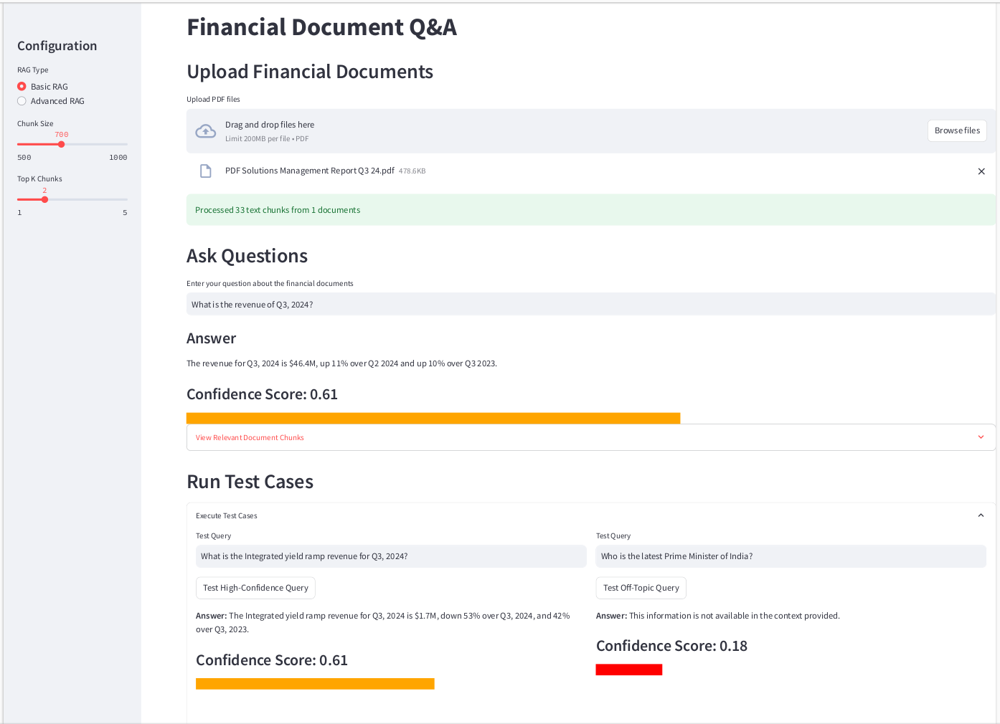
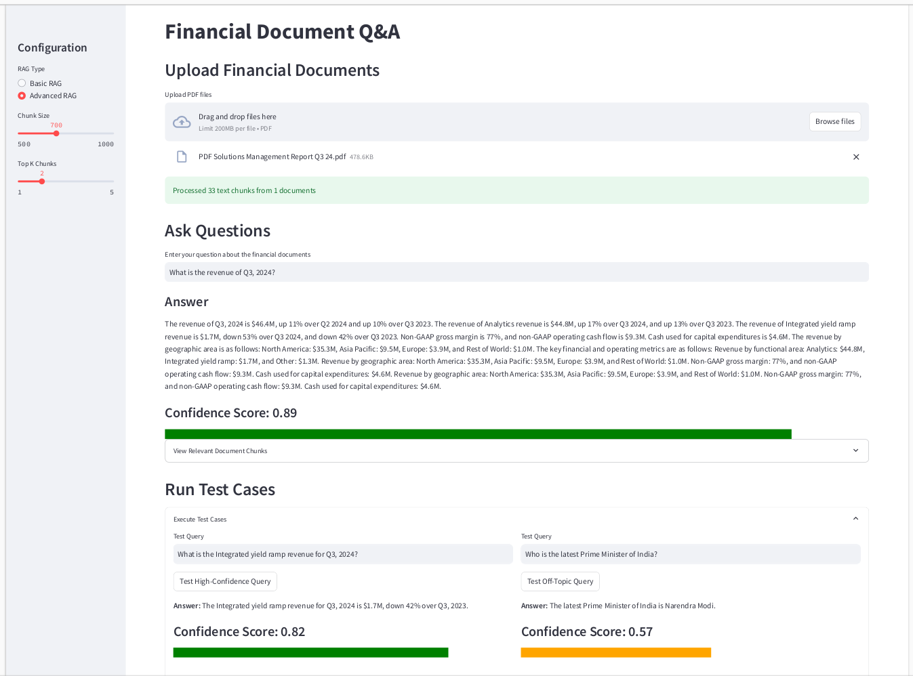

## Conversational AI Assignment 2
### Group : 70
### Members:
 - ATUL SHARMA
 - MONISH. K.B
 - SHIVAM RAVI
 - VENKATRAMAN SOUMYA P G VENKATRAMAN
 - VOBBANI VENKATESWARLU

### Problem Statement:
 - Implement Basic RAG
 - Implement Advanced RAG using `Memory-Augmented Retrieval`


### Setup the application:

1. Run below command from the root of the directory to create a virtual environment
    ```
    python -m venv ./venv
    ```
2. Activate the virtual environment.

    For linux/mac:
    ```
    source ./venv/bin/activate
    ```
    For Windows:
    ```
    .\venv\Scripts\activate
    ```
3. Install Dependencies:
    ```
    pip install -r requirements.txt
    ```

4. Run the application:
    ```
    streamlit run Group_70_rag_app.py
    ```

    This will start the **Web-UI** at `http://localhost:8501/`


### Usage:
1. On the UI select either of the two options Basic RAG or Advanced RAG on the side panel.

2. Upload a PDF file containing the company financial data. Optionally you can also select the `chunk size` on the side panel to chunk the data into specific chunk sizes, before uploading the documents.
    
    Note: Sample file `Group_70_sample_data_Q3_24.pdf` has been provided for reference.
3. Enter any query in the query box and hit enter to generate resopnse.
    
    Note: Optionally you can also select the number of chunks to refer dynamically by selecting the `top_k` parameter from the sidebr.
4. `Answer`, along with the `confidence scores` will be shown on the UI. Also,`top retrieved documents` will be available for exploration under an expander tab.
5. We have also provided a Test Case execution option, where you can test the application agains pre-configured high confidence and low confidence test case scenario.

### Reference Screenshots
- Basic RAG with sample test questions



- Advanced RAG with sample questions




### Snippets of Basic and Advanced RAG implementations:
- Basic RAG implementation is available under BasicRAG class in the code.
- Advanced RAG implementaion is available under AdvancedRAG class in the code.